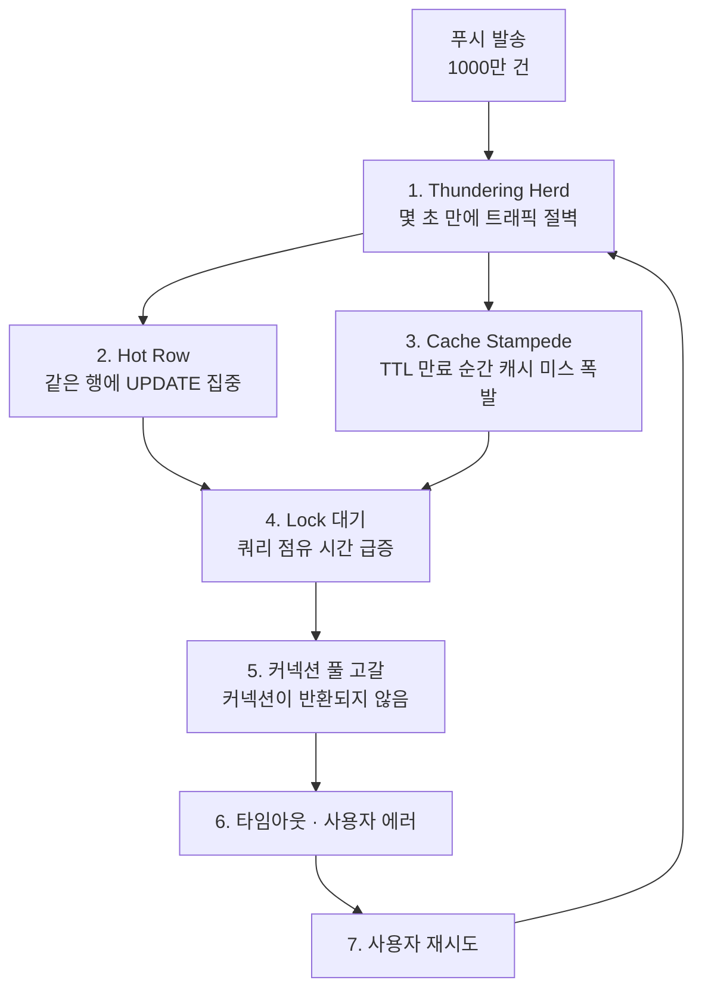
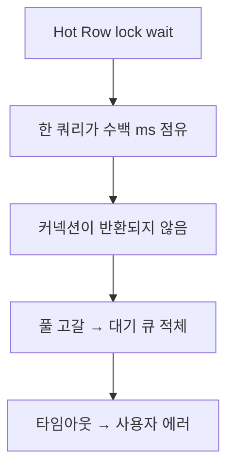

# 🔔 푸시 알림이 DB에 주는 영향

> 📝 **Notion**: https://app.notion.com/p/3c7d7d6851ff80afaef7d2c05737e1bf

> 🎯 **발표를 관통하는 한 문장**
> DB는 쿼리가 **무거워서** 죽지 않는다. 같은 쿼리가 **동시에** 실행돼서 죽는다.
> 푸시 알림은 그 동시성을 몇 초 만에 만들어내는 장치다.

---

# 0. 전체 그림 — 발표의 척추

개별 개념을 나열하면 청중이 못 따라온다. **하나의 인과 사슬**로 꿰면 10분 발표가 저절로 굴러간다.



> 🔁 마지막 화살표(**재시도 → 트래픽**)가 이 그림의 핵심이다.
> 이 되먹임 고리 때문에 **푸시가 끝나고 원인이 사라져도 시스템이 스스로 회복하지 못한다.**

---

# 1. Thundering Herd — 문제는 양이 아니라 모양이다

## 무슨 뜻인가

원래 운영체제 용어다. 하나의 이벤트가 발생했을 때 **잠자던 프로세스가 전부 동시에 깨어나** 자원을 두고 다투는 현상을 말한다. 정작 일을 하는 건 한 명인데 나머지는 깨어났다 다시 자는 낭비를 반복한다.

푸시 알림이 정확히 이 구조다. 1000만 대의 휴대폰이 **같은 순간에** 진동한다.

## 숫자로 보기

- 발송 1000만 건
- 열람률 10% → 100만 명
- 이 100만 명이 **3초 안에** 같은 페이지를 연다
- 즉 순간 **초당 33만 요청**

## 왜 "많은 것"과 "몰리는 것"이 다른가

| 구분 | 점심시간 트래픽 | 푸시 트래픽 |
|---|---|---|
| 상승 곡선 | 30분에 걸쳐 서서히 | 몇 초 만에 절벽처럼 |
| 오토스케일링 | 반응할 시간이 있다 | 인스턴스가 뜨는 데 수십 초~수 분 — 이미 늦었다 |
| 커넥션 풀 | 점진적으로 차오름 | 순식간에 바닥 |
| 캐시 | 자연스럽게 데워짐 | 차가운 상태로 정면 충돌 |

> ⚡ **발표 포인트**: 총량이 같아도 모양이 다르면 완전히 다른 문제다.
> "하루 100만 요청"은 아무 정보가 없다. **"피크 몇 초에 몇 건"**이 진짜 지표다.

<details>
<summary>더 깊이 — 왜 오토스케일링이 못 따라오나</summary>

- 스케일 아웃 트리거는 **지표를 관측한 뒤** 동작한다. CPU 지표 수집 주기만 해도 보통 15~60초.
- 인스턴스 부팅 + 애플리케이션 기동 + 헬스체크 통과까지 다시 수십 초.
- 다 합치면 **최소 1~3분**. 그런데 푸시 트래픽의 피크는 **3~10초**에 온다.
- 결론: 푸시는 **사후 대응이 원리적으로 불가능**하다. 사전에 미리 늘려두는 것(pre-warming) 외에 답이 없다.
</details>

---

# 2. 푸시 종류에 따라 터지는 곳이 다르다

같은 "푸시"라도 **어떤 쿼리가 폭발하는지**가 완전히 다르다. 이걸 구분하는 게 대비의 출발점이다.

| 유형 | 터지는 지점 | 부하 위치 | 대비책 |
|---|---|---|---|
| **쿠폰 발급형** | 재고 차감 UPDATE 하나에 모든 요청이 몰림 — 같은 행, 같은 컬럼 | Writer · Hot Row 경합 | 큐, 재고 분산 |
| **이벤트 페이지형** | 상품 목록 · 가격 SELECT 폭발 | Reader · 읽기 집중 | 캐시 워밍, Reader 증설 |
| **주문 유도형** | 주문 INSERT + 재고 UPDATE + 결제 INSERT | Writer · 쓰기 집중 | 비동기 처리, 트랜잭션 축소 |

> 🧭 읽기 집중형은 **Reader 증설로 돈으로 해결**된다.
> 쓰기 집중형, 특히 Hot Row는 **돈으로 해결되지 않는다.** 이 차이가 9장의 결론으로 이어진다.

---

# 3. Hot Row — 가장 위험한 패턴

## 상황

쿠폰 재고가 1만 개인데 1000만 명에게 푸시를 보냈다. 모든 요청이 **같은 행 하나**를 갱신한다.

```sql
UPDATE coupon
SET stock = stock - 1
WHERE coupon_id = 12345
  AND stock > 0
```

## 이 쿼리는 "좋은 쿼리"다

- 인덱스를 탄다 (`coupon_id`가 PK)
- 한 행만 건드린다
- 풀 스캔도, 조인도 없다
- **단독 실행 시 0.1ms**

> ⚠️ 쿼리 튜닝으로는 이 문제를 절대 못 푼다. **이미 최적의 쿼리이기 때문이다.**
> 문제는 쿼리가 아니라 **한 행에 대한 접근이 직렬화된다는 사실** 그 자체다.

## 왜 막히는가 — 락은 쿼리가 아니라 트랜잭션 단위로 유지된다

이게 사람들이 가장 많이 오해하는 지점이다.

1. `UPDATE`가 실행되는 순간 그 행에 **배타 락(X Lock)**이 걸린다
2. 락은 UPDATE가 끝날 때가 아니라 **트랜잭션이 COMMIT/ROLLBACK될 때** 풀린다
3. 그사이 애플리케이션이 다른 일(로그 기록, 외부 API 호출, 추가 쿼리)을 하면 **그동안 계속 락을 쥐고 있다**

즉 실제 락 점유 시간은 쿼리 시간(0.1ms)이 아니라 **트랜잭션 전체 길이**다.

## 한 행의 물리적 처리량 계산

트랜잭션 전체가 5ms 걸린다고 하면:

$$
\text{한 행의 최대 처리량} = \frac{1000\text{ms}}{5\text{ms}} = 200\ \text{TPS}
$$

> 🧱 **이 200 TPS는 물리적 상한이다.**
> 서버를 100대로 늘려도, DB 스펙을 10배로 올려도 200 TPS다.
> 한 행은 한 번에 한 명만 처리할 수 있기 때문이다.

## 대기 시간이 어떻게 폭발하는가

동시에 1만 명이 몰렸다면, 줄의 맨 뒤에 선 사람의 대기 시간은:

$$
\frac{10{,}000\ \text{명}}{200\ \text{TPS}} = 50\ \text{초}
$$

MySQL InnoDB의 락 대기 기본 한계값(`innodb_lock_wait_timeout`)이 **50초**다. 즉 뒤쪽 사람들은 **줄줄이 타임아웃 후 롤백**된다.

> ⚔️ 나머지는 전부 줄을 선다. **큐가 아니라 전쟁이다.**
> 큐는 순서가 보장되지만, 락 경합은 **누가 먼저 잡을지 보장되지 않는다.** 운 나쁜 요청은 계속 밀린다.

<details>
<summary>더 깊이 — 락 대기 · 데드락 · 낙관적 락의 차이</summary>

- **락 대기(Lock Wait)**: 남이 쥔 락을 기다리는 정상 동작. 오래 걸리면 타임아웃.
- **데드락(Deadlock)**: A가 1번 행, B가 2번 행을 쥔 채 서로의 것을 원하는 교착. DB가 감지해 **한쪽을 즉시 죽인다**. 락 대기와 달리 기다리지 않고 바로 실패.
- **낙관적 락(Optimistic Lock)**: 락을 걸지 않고 버전 번호로 충돌을 감지 → 충돌 시 재시도.
	- **주의: 경합이 심한 Hot Row에서는 낙관적 락이 오히려 더 나쁘다.** 거의 모든 시도가 충돌해 재시도만 무한 반복되기 때문. 경합이 **드물 때** 쓰는 기법이다.
- 이 주제는 발표 Q&A에서 나올 확률이 높다.
</details>

---

# 4. 커넥션 풀이 DB보다 먼저 죽는다

## 관측되는 현상

> 🔍 CPU 정상. 메모리 정상. 디스크 I/O 정상. **커넥션만 0.**
> 장애 원인을 DB 리소스 지표에서 찾으면 아무것도 안 보인다.

이유는 단순하다. **대기는 CPU를 쓰지 않는다.** 락을 기다리는 트랜잭션은 그냥 멈춰 있을 뿐이라 어떤 리소스 지표도 올라가지 않는다. 그런데 커넥션은 계속 붙잡고 있다.

## 왜 커넥션 풀이 증폭 장치인가



## 리틀의 법칙으로 계산해보기

이미 정리해 둔 공식 `적절한 풀 크기 = TPS × 평균 응답 시간`이 바로 **리틀의 법칙**이다. 이걸 뒤집으면 처리량이 나온다.

$$
\text{처리량(TPS)} = \frac{\text{풀 크기}}{\text{평균 응답 시간}}
$$

| 상황 | 풀 크기 | 응답 시간 | 처리 가능 TPS |
|---|---|---|---|
| 평상시 | 50 | 10ms | **5,000** |
| Hot Row 경합 중 | 50 | 500ms | **100** |

> 💡 쿼리가 **50배 느려지자 처리량도 정확히 50배 떨어졌다.**
> 그런데 들어오는 요청은 줄지 않는다. 초과분은 전부 대기 큐에 쌓이고, 곧 타임아웃이 된다.
> 커넥션 풀은 **"조금 느려짐"을 "완전한 고갈"로 증폭시키는 장치**다.

## 풀을 늘리면 되지 않나? — 아니다

- 커넥션을 100개로 늘려도 **한 행은 여전히 200 TPS**다
- 늘어난 커넥션은 전부 같은 행 앞에서 대기할 뿐
- 오히려 DB 쪽 컨텍스트 스위칭과 메모리 부담만 늘어 **더 느려진다**
- 커넥션 풀은 **동시성 제한 장치**지 처리량 증대 장치가 아니다

---

# 5. Cache Stampede — 캐시가 있어도 뚫린다

## 무슨 일이 벌어지나

이벤트 페이지를 캐시에 올려두면 평소엔 완벽하다. 문제는 **TTL이 만료되는 그 순간**이다.

1. TTL 만료 → 캐시가 비워짐
2. 그 순간 도착한 수십만 요청이 **전부 캐시 미스**
3. 전부 DB로 직행
4. 한 명만 다녀와서 채우면 될 일을 **만 명이 동시에** 한다
5. 첫 번째 요청이 캐시를 채우기 전까지, 뒤따르는 요청도 계속 미스가 난다

> 💥 캐시가 있어서 안전한 게 아니다. **캐시가 없어지는 순간**이 위험하다.
> 평소 캐시 히트율이 99%라는 건, 그 1%가 한꺼번에 몰릴 때 DB가 **평소의 100배 부하**를 받는다는 뜻이기도 하다.

## 해결책 4가지

원본에는 캐시 워밍만 나오는데, 실무에서는 보통 아래를 조합한다. **발표에서 차별화되는 부분**이라 알아두면 좋다.

| 기법 | 동작 | 특징 |
|---|---|---|
| **캐시 워밍** | 이벤트 전에 미리 채우고 TTL을 이벤트 시간에 맞춤 | 사전 대비 가능할 때 가장 확실 |
| **뮤텍스 / Single-flight** | 미스 시 **한 요청만** DB로 보내고 나머지는 대기 | 가장 근본적. 대기 시간이 생김 |
| **TTL 지터(Jitter)** | TTL에 랜덤 값을 더해 만료 시점을 흩뜨림 | 구현이 가장 쉬움. 동시 만료 자체를 방지 |
| **Stale-While-Revalidate** | 만료돼도 옛 값을 주고, 뒤에서 조용히 갱신 | 사용자는 절대 기다리지 않음. 잠깐 낡은 데이터 허용 필요 |

---

# 6. 실제 사례 2개

## 사례 A — 선착순 쿠폰: 1000장이 10만 건의 UPDATE를 만든다

선착순 1000장. 푸시가 나가고 30초.

- 쿠폰 테이블의 **한 행**에 UPDATE가 쏟아진다
- 대기가 길어지면 `lock wait timeout`에 걸려 롤백된다
- 실패한 요청이 **자동 재시도**한다
- 사용자도 "쿠폰 받기"를 **다시 누른다**
- 프론트에서 버튼을 비활성화해도 **새로고침으로 우회**한다

> 🌀 **실패가 재시도를 부르고, 재시도가 부하를 키운다.**
> 쿠폰은 1000장인데 UPDATE 시도는 10만 건이 된다. 99%가 실패할 운명의 쿼리로 DB가 마비된다.

<details>
<summary>더 깊이 — 이 현상의 정식 이름: 메타스테이블 장애</summary>

- 부하 → 실패 → 재시도 → 더 큰 부하 → 더 많은 실패. **양성 피드백 루프**다.
- 무서운 점은 **원인이 사라져도 회복되지 않는다**는 것. 푸시 발송이 끝나고 신규 유입이 멈춰도, 재시도만으로 시스템이 계속 죽어 있다.
- 이를 **Metastable Failure(준안정 장애)**라 한다. 벗어나려면 사람이 개입해 **트래픽을 강제로 끊어야** 한다.
- 해법 키워드: **Exponential Backoff + Jitter**(재시도 간격을 지수적으로 늘리고 랜덤화), **Circuit Breaker**(실패율이 높으면 아예 요청을 차단해 회복 시간을 벌어줌).
- 발표에서 이 용어 하나 던지면 인상이 크게 달라진다.
</details>

## 사례 B — 타임세일 랜딩: 바뀐 건 동시 실행 수뿐

오후 5시 타임세일, 4시 55분에 푸시.

- 사용자는 페이지를 열어놓고 **기다린다**
- 5시 정각, 전원이 **동시에 새로고침**을 누른다
- 하필 방금 가격이 바뀌어 **캐시가 무효화된 상태**
- 수십만 요청이 전부 DB까지 내려오고, Reader가 순간적으로 CPU 한계에 닿는다

> 🎯 **평소와 똑같은 쿼리다. 바뀐 건 동시 실행 수뿐이다.**
> DB는 쿼리에 죽지 않는다. 동시성에 죽는다.

여기서 주목할 점: 푸시가 4시 55분에 나갔는데 **피크는 5시 정각**이다. 사용자가 스스로 시간을 맞춰 대기했기 때문이다. **발송 시각을 분산해도 피크가 분산되지 않는 경우**가 있다는 뜻이다.

---

# 7. 방어 1 — 애플리케이션과 인프라

> 🛡️ 원칙: **DB까지 도달하기 전에 끊는다.**
> DB 앞에서 막는 게 항상 DB 안에서 버티는 것보다 싸다.

| 방어 | 내용 | 효과 |
|---|---|---|
| **푸시 분산 발송** | 1000만 건을 한 번에 보내지 않고 5분에 걸쳐 나눠 보낸다 | 가장 싸고 효과가 크다. 코드 변경 없이 피크만 깎는다 |
| **큐 기반 처리** | 쿠폰 발급을 동기로 처리하지 않는다. 큐에 넣고 순차 처리, 사용자에겐 "발급 중"을 보여준다 | DB 부하를 **일정하게** 만든다. Hot Row의 근본 해법 |
| **캐시 워밍** | 이벤트 시작 전에 캐시를 미리 채우고 TTL도 이벤트 시간에 맞춰 조정 | Cache Stampede 원천 차단 |
| **Rate Limiting** | 동일 사용자의 반복 요청을 제한. 버튼 연타와 새로고침을 앞단에서 끊는다 | 재시도 폭풍의 되먹임 고리를 끊는다 |

> 🔑 **큐가 왜 근본 해법인가**
> 큐는 **유입 속도와 처리 속도를 분리**한다. 초당 33만 건이 들어와도 DB에는 초당 200건만 흘려보낼 수 있다.
> DB는 자기 페이스대로 일하고, 넘치는 요청은 큐에서 기다린다. **Hot Row의 200 TPS 한계를 인정하고 그에 맞춰 설계하는 것**이다.

---

# 8. 방어 2 — DB 레벨

## Reader 스케일 아웃

- 이벤트 전에 **미리** 늘려두고 끝나면 줄인다
- 읽기 부하에는 가장 직접적인 해법
- **한계: 복제 지연(Replication Lag).** 방금 쿠폰을 받았는데 조회하면 안 보이는 현상이 생긴다. 쓰기 직후 읽기는 Writer로 보내는 처리가 필요하다

## 커넥션 풀 분리

- 이벤트용 엔드포인트의 풀을 **따로** 잡는다
- 이벤트 트래픽이 일반 트래픽의 커넥션을 먹지 않게 격리
- **핵심 가치**: 이벤트가 터져도 로그인·결제 같은 일반 기능은 살아남는다. 이것이 **벌크헤드(Bulkhead) 패턴**이다

## Hot Row 분산

재고를 한 행에 두지 않고 여러 행으로 쪼갠다.

```sql
-- 재고 1000개를 10개 버킷으로 분산
-- bucket_id: 0 ~ 9, 각 100개씩
UPDATE coupon_stock
SET stock = stock - 1
WHERE coupon_id = 12345
  AND bucket_id = ?   -- 사용자 ID 해시로 버킷 배정
  AND stock > 0
```

- 락 경합이 **1/10**로 줄어든다 → 처리량 200 TPS에서 2,000 TPS로
- **트레이드오프: 버킷별 소진 편차.** 어떤 버킷은 남았는데 배정받은 버킷이 비어 실패할 수 있다. 실패 시 다른 버킷을 재탐색하는 로직이 필요하다
- 총 재고 집계 시 **모든 버킷을 합산**해야 한다

<details>
<summary>더 깊이 — Redis 카운터로 DB 앞에서 막기</summary>

- Redis의 원자적 감소 연산(`DECR`)으로 **DB에 도달하기 전에** 선착순을 판정한다.
- Redis는 단일 스레드라 원자성이 보장되고, 초당 수만~수십만 건을 처리한다.
- 선착순에서 탈락한 요청은 **DB를 아예 건드리지 않는다.** 1000장짜리 이벤트에서 DB로 가는 요청이 10만 건 → 1000건으로 줄어든다.
- 주의: Redis와 DB 사이 정합성 문제가 남는다. Redis에서 성공했는데 DB 저장이 실패하면? → 최종 확정은 DB에서, Redis는 **필터** 역할로 한정하는 게 안전하다.
</details>

---

# 9. 스케일링으로 안 풀리는 것 — 발표의 클라이맥스

> ✅ **읽기 — 된다**
> Reader를 늘리면 SELECT는 분산된다. 돈으로 해결되는 문제다.

> ❌ **쓰기 — 안 된다**
> Writer도 하나, Hot Row도 하나. 서버를 아무리 늘려도 **한 행에 대한 UPDATE는 직렬 처리**다.

## 왜 그런가 — 암달의 법칙

전체 작업 중 **직렬로만 처리되는 구간**이 있으면, 나머지를 아무리 병렬화해도 전체 속도는 그 구간에 묶인다.

$$
\text{Hot Row에 대한 UPDATE의 직렬 비율} = 100\%
$$

병렬화할 수 있는 부분이 0%다. 그래서 서버 대수가 전혀 영향을 주지 못한다.

> 🧱 **수평 확장으로 풀리지 않는 병목이 있다. 인프라가 아니라 설계로 풀어야 한다.**
> 큐, 재고 분산, 비동기 처리 — **서버의 문제가 아니라 코드의 문제다.**

## 이미 정리해 둔 개념과 연결하기

이 주제는 `DB 필수 개념` 노트의 내용이 **실전에서 어떻게 터지는지**를 보여주는 사례집이다. 발표에서 이 연결을 보여주면 깊이가 확 산다.

| 이미 정리한 개념 | 푸시 알림 상황에서의 발현 |
|---|---|
| DB 성능의 본질은 I/O가 아니라 **동시성** | 쿼리는 0.1ms로 최적이다. 그런데도 죽는다 — 정확히 이 명제의 증명 |
| 커넥션 풀 = **동시성 제한 장치** | 4장. DB보다 먼저 고갈되며, 느려짐을 고갈로 증폭시킨다 |
| 적절한 풀 크기 = TPS × 응답 시간 | 리틀의 법칙. 뒤집어서 처리량 붕괴를 계산하는 데 그대로 쓰인다 |
| 대기시간 = 서비스시간 / (1 − 사용률) | 평소 사용률 60%에서는 대기가 2.5배. 푸시가 95%로 밀어올리면 **20배**, 99%면 **100배** |
| 여유 용량 20%는 비용이 아니라 **보험** | 푸시는 그 보험을 몇 초 만에 소진시키는 이벤트. 왜 60%를 목표로 설계해야 하는지의 실제 사례 |
| 인덱스는 **락 범위를 줄이는** 장치 | 인덱스가 있어도 Hot Row는 못 막는다 — 범위를 한 행까지 줄여도 **그 한 행에 몰리면** 소용없다는 한계 |
| 동시성 해결 전략: 락 최소화 · 비동기 · 큐 · 샤딩 | 7~8장의 방어책이 정확히 이 네 가지 |

> ⭐ 특히 **"인덱스는 락 범위를 줄이는 장치"**와 **"그런데 Hot Row는 인덱스로 못 막는다"**의 연결이 좋다.
> 기존 지식의 **한계 지점**을 짚는 구성이라 청중이 배웠다는 느낌을 받는다.

---

# 10. DBA 관점의 정리

마케팅이 푸시를 보내겠다고 하면 DBA는 반드시 물어야 한다.

> **몇 시에, 몇 명에게, 어떤 종류로.**

| 답변 | 대비 항목 |
|---|---|
| 쿠폰 · 선착순 | Hot Row 대비 — 큐 도입, 재고 분산, Rate Limiting |
| 타임세일 · 이벤트 페이지 | 캐시 워밍 확인, TTL을 이벤트 시각에 맞춰 조정 |
| 공통 | Reader 사전 증설, 커넥션 풀 분리, 발송 시각 분산 |

> ⭐ 푸시 한 방은 마케팅의 무기다. 그런데 **그 무기의 반동은 DB가 맞는다.**
> 사전에 알면 대비하고, 사후에 알면 장애 보고서를 쓴다. **그 차이가 DBA의 존재 이유다.**

---

# 발표 설계 (PPT 구성안)

## 슬라이드 흐름 — 10~15분 기준

| # | 슬라이드 | 핵심 메시지 / 시각 요소 |
|---|---|---|
| 1 | 표지 | 푸시 알림이 DB에 주는 영향 |
| 2 | 충격의 숫자 | **1000만 → 100만 → 3초 → 초당 33만.** 숫자만 크게. 설명 없이 침묵 |
| 3 | 문제 정의 | 점심시간 곡선 vs 푸시 곡선 **그래프 2개 나란히**. 이 발표 최고의 시각 자료 |
| 4 | 유형별 부하 지점 | 3분류 표. 이후 전개의 지도 역할 |
| 5 | Hot Row (1) — 좋은 쿼리 | SQL을 띄우고 **"이 쿼리의 문제점은?"** 질문 → "없습니다"로 반전 |
| 6 | Hot Row (2) — 200 TPS의 벽 | 계산식 + **"서버 100대여도 200 TPS"** |
| 7 | 커넥션 풀 고갈 | 0장의 인과 사슬 다이어그램 + **"CPU 정상, 커넥션만 0"** |
| 8 | Cache Stampede | TTL 만료 순간의 타임라인 그림 |
| 9 | 사례 2개 | 스토리텔링. 재시도 되먹임 고리를 **원형 화살표**로 |
| 10 | 방어 — 앱 · 인프라 | 표 그대로. "DB 앞에서 끊는다" |
| 11 | 방어 — DB 레벨 | Hot Row 분산은 **그림으로** (한 행 → 10개 버킷) |
| 12 | 클라이맥스 | 읽기 ✅ / 쓰기 ❌ 대비. **"인프라가 아니라 설계"** |
| 13 | 마무리 | **"무기의 반동은 DB가 맞는다"** |

## 발표 팁

- **2번 슬라이드에서 침묵을 3초 쓴다.** 숫자만 띄우고 아무 말 안 하면 집중도가 확 올라간다
- **5~6번이 이 발표의 심장이다.** "완벽한 쿼리인데 죽는다"는 반전이 청중의 상식을 깬다. 여기에 시간을 가장 많이 배분할 것
- 다이어그램은 **0장의 인과 사슬 하나**로 통일하고, 각 슬라이드에서 **해당 부분만 강조 표시**하며 진행하면 흐름이 끊기지 않는다
- 계산식(200 TPS, 50초, 5000→100 TPS)은 **반드시 슬라이드에 띄운다.** 말로만 하면 안 남는다

## 예상 질문 & 답변

<details>
<summary>Q. 큐로 비동기 처리하면 사용자는 결과를 언제 아나요?</summary>

- 즉시 "발급 처리 중" 응답 → 폴링 또는 웹소켓/SSE로 결과 전달.
- **결과적 일관성(Eventual Consistency)**을 받아들이는 설계다.
- UX 보완: 대기 순번을 보여주면 이탈률이 크게 준다(대기실 패턴).
</details>

<details>
<summary>Q. Hot Row를 분산하면 재고가 안 맞지 않나요?</summary>

- 총 재고는 모든 버킷의 합으로 관리한다. 총량은 정확히 맞는다.
- 다만 **버킷별 소진 편차**가 생겨, 전체엔 재고가 남았는데 개별 사용자는 실패할 수 있다.
- 보완: 실패 시 다른 버킷 재탐색, 또는 잔여 재고를 주기적으로 재분배.
</details>

<details>
<summary>Q. Redis로 하면 되는데 왜 DB를 신경 쓰나요?</summary>

- Redis는 **필터**다. 최종 확정과 정합성 보장은 DB의 몫.
- Redis 장애 시 데이터 유실 가능성이 있어 Redis 단독으로는 금액·재고 확정을 맡기기 어렵다.
- 다만 **DB에 도달하는 요청을 100분의 1로 줄이는** 효과는 매우 크다.
</details>

<details>
<summary>Q. Reader를 늘리면 되는 것 아닌가요?</summary>

- 읽기 부하는 실제로 해결된다.
- 그러나 **쓰기는 Writer 하나**이고 Hot Row는 그중에서도 한 행이다. 전혀 분산되지 않는다.
- 추가로 **복제 지연** 때문에 "방금 받은 쿠폰이 안 보이는" 문제가 생긴다.
</details>

<details>
<summary>Q. CPU도 정상인데 왜 장애인가요?</summary>

- **대기는 CPU를 쓰지 않기 때문이다.** 락을 기다리는 트랜잭션은 멈춰 있을 뿐이다.
- 그래서 리소스 지표만 보면 아무 이상이 없다.
- 봐야 할 지표는 **커넥션 풀 사용률, 락 대기 시간, 큐 대기 길이**다.
</details>

<details>
<summary>Q. 낙관적 락을 쓰면 되지 않나요?</summary>

- 경합이 **드물 때** 유효한 기법이다.
- Hot Row처럼 경합이 극심하면 거의 모든 시도가 충돌해 **재시도만 폭증**한다. 오히려 더 나빠진다.
- 이 경우엔 비관적 락 + 큐, 또는 애초에 경합을 없애는 재고 분산이 맞다.
</details>

---

# 공부 키워드

> 🔎 영문 키워드로 검색하면 자료의 양과 질이 훨씬 낫다. **굵은 표시**가 우선순위가 높은 것들이다.

## 트래픽 패턴

- **Thundering Herd Problem** — 이 발표의 출발점. OS 원본 개념부터 보면 이해가 빠르다
- **Traffic Spike / Flash Crowd** — 순간 트래픽 급증의 일반 명칭
- Slashdot Effect — 특정 링크 노출로 트래픽이 폭발하는 고전 사례
- Pre-warming / Pre-scaling — 사전 증설 전략

## 락과 동시성

- **Hot Row / Hot Spot Contention** — 핵심 중의 핵심
- **Row Lock vs Table Lock** — 이미 정리했지만 푸시 맥락에서 재확인
- **Lock Wait Timeout** — MySQL의 `innodb_lock_wait_timeout`, 기본 50초
- **Deadlock vs Lock Wait** — 차이를 명확히. Q&A 단골
- Optimistic Lock vs Pessimistic Lock — 경합 빈도에 따른 선택 기준
- Lock Contention / Lock Escalation
- **Amdahl's Law** — 직렬 구간이 있으면 병렬화가 무의미해지는 이유
- MVCC — InnoDB가 읽기와 쓰기를 어떻게 분리하는지

## 커넥션과 큐잉

- **Little's Law** — `풀 크기 = TPS × 응답시간`의 정체
- **Connection Pool Exhaustion** — 장애의 실제 발현 형태
- **Queueing Theory / Utilization Law** — `대기시간 = 서비스시간/(1−사용률)`
- HikariCP Pool Sizing — 실무 설정 가이드. "풀은 작을수록 좋다"는 반직관적 결론이 흥미롭다
- **Bulkhead Pattern** — 커넥션 풀 분리의 정식 명칭
- Backpressure — 처리 못 할 요청을 앞단에서 밀어내는 설계

## 캐시

- **Cache Stampede / Thundering Herd on Cache** — 5장 주제
- **Cache Warming / Cache Preloading**
- **TTL Jitter** — 가장 간단하면서 효과적인 해법
- Single-flight / Request Coalescing — 중복 요청 병합
- **Stale-While-Revalidate** — 낡은 값을 주고 뒤에서 갱신
- Probabilistic Early Expiration (XFetch) — 확률적으로 미리 갱신
- Cache Penetration / Cache Avalanche — 중국권 자료에서 자주 쓰는 분류. 관련 사례가 풍부하다

## 장애 이론

- **Metastable Failure** — 원인이 사라져도 회복되지 않는 장애. 2021년 HotOS 논문이 원전
- **Retry Storm** — 재시도가 만드는 2차 부하
- **Exponential Backoff and Jitter** — AWS 아키텍처 블로그의 글이 명문
- **Circuit Breaker** — 실패율이 높을 때 아예 차단해 회복 시간을 벌기
- Cascading Failure — 한 컴포넌트의 장애가 연쇄되는 현상
- Load Shedding — 과부하 시 의도적으로 요청을 버리기

## 완화 기법

- **Rate Limiting** — Token Bucket, Leaky Bucket 두 알고리즘
- **Message Queue 기반 비동기 처리** — Kafka, RabbitMQ, SQS
- **Sharding / Counter Sharding** — Hot Row 분산의 정식 명칭
- Virtual Waiting Room — 대기열 페이지. 넷마블·인터파크 티켓팅 사례
- Idempotency Key — 재시도해도 중복 처리되지 않게 하는 키
- Read Replica & Replication Lag — Reader 증설의 한계
- Redis `DECR` / Lua Script Atomicity — DB 앞단 원자적 카운터

## 실무 지표

- 커넥션 풀: **Active 수, Pending(대기) 수, Wait Time** — 원본 4장의 "커넥션만 0"을 잡아내는 지표
- MySQL: `SHOW ENGINE INNODB STATUS`의 락 대기 정보, `performance_schema`의 락 이벤트
- APM: P99 응답 시간 — 평균은 Hot Row 문제를 숨긴다
- 캐시: 히트율과 **미스가 몰리는 시점의 분포**

## 참고할 만한 사례 검색어

- "선착순 쿠폰 동시성 제어" — 한국어 기술 블로그에 실전 사례가 많다
- "티켓팅 대기열 시스템 아키텍처"
- "Black Friday database scaling"
- "flash sale inventory oversell" — 재고 초과 판매 문제
