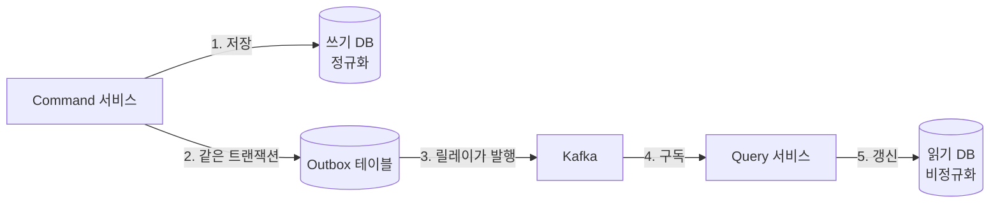

# CQRS와 Query Facade + S3

> 📝 **Notion**: https://app.notion.com/p/3cfd7d6851ff80e1b814cd08d70257f2
> 🏷️ **프로젝트**: MoniMonitor · **작성일**: 2026-09-02

> **🧩 한 줄 요약** — CQRS는 읽기와 쓰기를 **다른 모델 · 다른 저장소**로 쪼개는 대신 **최종 일관성과 동기화 파이프라인**을 떠안는 선택이다. Query Facade + S3는 그 읽기 쪽을 객체 스토리지에 뒀을 때, S3가 못 하는 **검색 · 페이징 · 조립**을 앞단 API 서버가 대신해 주는 구조다.

---

## 1. 왜 CQRS를 꺼내는가

원본이 짚은 두 갈래가 정확하다. **단일 DB의 부하 문제**와 **MSA의 조회 문제**.

- **단일 DB 부하** — 무거운 조회가 커넥션을 오래 붙잡으면 쓰기 요청이 커넥션을 못 얻고 밀린다
- **MSA 조회 한계** — 서비스마다 DB가 쪼개져 있어 JOIN이 불가능하다
  - **API Composition**(여러 서비스를 호출해 메모리에서 합치기)은 임시방편일 뿐
  - 호출 수가 N배로 늘고, 정렬 · 페이징을 메모리에서 하면 전체를 다 받아와야 한다
  - "각 서비스 컬럼을 섞어서 최신순 페이징" 같은 요구는 사실상 불가능

> **❌ 정정 — "락 때문에 커넥션이 안 풀려서 SPOF"**
>
> 두 개념이 섞였다.
> **(1)** 일반 `SELECT`는 MVCC(스냅샷 읽기)라서 보통 **락 대기를 하지 않는다**. 진짜 병목은 락이 아니라 CPU · 디스크 IO · 버퍼 풀 경합, 그리고 **커넥션 풀 고갈**이다.
> **(2)** SPOF는 "발생하는 사고"가 아니라 **구조적 속성**이다. 단일 DB는 처음부터 이미 SPOF고, 읽기/쓰기 혼재는 그 SPOF를 **더 쉽게 터뜨리는 요인**일 뿐이다.
> → 면접용 한 문장: "조회 부하가 커넥션 풀을 고갈시켜 쓰기까지 같이 죽는 **장애 전파**가 문제였습니다."

---

## 2. Command와 Query — 무엇이 다른가

| | **Command (CUD)** | **Query (R)** |
| --- | --- | --- |
| 책임 | 상태 변경 | 화면이 원하는 형태로 반환 |
| 우선 가치 | 무결성 · 정합성 | 조회 속도 |
| 모델링 | **정규화** (중복 제거) | **비정규화** (미리 조립해 둠) |
| 저장소 예 | RDBMS | Redis, Elasticsearch, NoSQL, S3 |

핵심은 **저장소를 나누는 것보다 모델을 나누는 것**이다. 같은 DB를 쓰면서 읽기 전용 DTO/뷰만 따로 두는 것도 CQRS의 첫 단계다.

💡 적용 레벨 — 처음부터 저장소를 쪼갤 필요는 없다

  **Level 0.** 같은 DB · 같은 엔티티 (일반 CRUD)
  **Level 1.** 같은 DB, 읽기 전용 쿼리 모델 분리 (JPA 엔티티 대신 조회 전용 DTO · 뷰)
  **Level 2.** 리드 레플리카로 읽기 트래픽 분산 (동일 스키마)
  **Level 3.** 별도 읽기 저장소 + 이벤트 동기화 (진짜 CQRS)
  레벨이 오를수록 성능은 좋아지지만 **운영 복잡도와 일관성 비용**이 같이 오른다. Level 1~2로 해결되는데 Level 3을 가는 게 가장 흔한 오버엔지니어링이다.

---

## 3. 동기화 — 쓴 게 어떻게 읽기로 넘어오나

| | **애플리케이션 이벤트** | **CDC (로그 기반)** |
| --- | --- | --- |
| 방식 | 코드에서 직접 발행 | DB 트랜잭션 로그를 추적 |
| 장점 | **도메인 의미**가 담긴 이벤트 | 코드 수정 불필요, **누락이 없음** |
| 단점 | Dual Write 위험 → Outbox 필요 | DB 스키마에 결합, row 단위라 의미가 얕음 |

**Dual Write 문제** — "DB에 저장하고 Kafka로 발행"은 두 개의 서로 다른 시스템에 쓰는 것이라, 저장은 됐는데 발행이 실패하면 읽기 모델이 영원히 어긋난다. 원본이 마지막에 적은 **Outbox 패턴**이 정확히 이 문제의 해법이다. 이벤트를 같은 트랜잭션 안에서 `outbox` 테이블에 넣고, 별도 릴레이(보통 Debezium 같은 CDC)가 그걸 읽어 발행한다.

⚠️ 이벤트 소비 쪽이 반드시 지켜야 할 두 가지

  **멱등성** — 메시지 브로커는 대개 **at-least-once**라 같은 이벤트가 두 번 올 수 있다. 이벤트 ID를 기록해 걸러내거나, 읽기 모델 갱신을 `UPDATE`가 아니라 **upsert**로 짜서 여러 번 실행돼도 결과가 같게 만든다.
  **순서** — Kafka는 **파티션 안에서만** 순서를 보장한다. 같은 엔티티의 이벤트가 뒤섞이면 안 되므로 **엔티티 ID를 파티션 키**로 쓴다.
  **컨슈머 랙** — 소비가 밀리면 읽기 모델 전체가 과거에 머문다. 랙은 반드시 지표로 감시해야 한다.

---

## 4. 최종 일관성 — 제일 아픈 지점

원본의 "이 차이는 보통 인정합니다"가 맞는 태도지만, **사용자가 자기 글을 못 보는 건 인정할 수 없다.**

- **Read-Your-Own-Writes** — 글을 쓰고 목록에 갔는데 없다. CQRS에서 가장 먼저 터지는 UX 문제
  - 쓰기 응답으로 받은 데이터를 **화면에 낙관적으로 먼저 반영**
  - 또는 쓰기 직후 짧은 구간만 **Command 쪽에서 직접 읽기**
- **읽기 모델은 언제든 버릴 수 있다** — 파생 데이터이므로 이벤트를 처음부터 다시 흘려 **재구축(replay)** 가능. 스키마를 바꾸고 싶으면 새 읽기 모델을 만들어 갈아끼우면 된다. 이게 CQRS의 숨은 장점

> **❌ 정정 — "이벤트 소싱으로 동기화한다"**
>
> **Event Sourcing은 동기화 수단이 아니다.** 상태를 "현재 값"이 아니라 **"일어난 이벤트의 시퀀스"로 저장하는 방식**이다.
> 동기화를 하는 건 **이벤트 발행 또는 CDC**이고, ES는 그것과 궁합이 좋을 뿐 **CQRS의 필수 요소가 아니다.** 원본도 "기타"에서 "선택적 구현 방식 중 하나"라고 스스로 바로잡았으니, 앞쪽 문장만 고치면 된다.

---

## 5. 레플리케이션과 무엇이 다른가

원본의 대비가 정확하다. **"구조가 같은가"**가 갈림길이다.

| | **레플리케이션** | **CQRS** |
| --- | --- | --- |
| 스키마 | 원본과 **동일** | 읽기 목적에 맞게 **다르게** |
| 하는 일 | 같은 데이터를 복제 | 데이터를 **변환 · 조립**해서 저장 |
| 지연 원인 | 복제 지연 | 이벤트 처리 지연 |
| 도입 비용 | 낮음 (DB 설정) | 높음 (파이프라인 개발 · 운영) |

한 줄로: **레플리케이션은 "같은 걸 더 많이", CQRS는 "다른 걸 따로".**

---

## 6. Query Facade + S3

읽기 저장소로 **S3(객체 스토리지)** 를 골랐을 때 쓰는 형태다.

- **S3는 DB가 아니다** — 키로 GET하거나 접두사로 LIST할 수 있을 뿐, `WHERE` · `ORDER BY` · `OFFSET`이 없다
- 그래서 프론트와 S3 사이에 **Query Facade**라는 API 서버를 세운다

**조회 흐름** — 클라이언트 요청 → 파사드가 필요한 객체를 S3에서 GET → 메모리에서 압축 해제 · 필터링 · 정렬 → 완성된 JSON 반환 → 클라이언트는 그리기만.

- **파티션 키 설계가 곧 인덱스** — `project=A/date=2026-09-02/metrics.json.gz` 처럼 경로를 쪼개 두면, 파사드가 **읽어야 할 객체 수 자체를 줄일 수 있다**. 이 설계가 성능의 90%를 결정한다
- **흔한 절충안** — 메타데이터(검색 · 정렬 키)는 DB에, 무거운 본문은 S3에. 목록은 DB로 페이징하고 상세만 S3에서 꺼낸다
- **참고** — S3는 2020년 12월부터 **강한 읽기 일관성**을 보장한다. "S3는 방금 쓴 게 안 보인다"는 옛날 이야기

> **⚠️ 함정 — 캐시 없는 파사드는 느리고 비싸다**
>
> S3 GET은 DB 쿼리보다 훨씬 느리고(밀리초 단위가 아니라 수십 밀리초 이상), **요청 건수와 전송량으로 과금**된다. 매 요청마다 전체 파일을 받아 압축을 푸는 구조는 지연과 비용이 같이 터진다.
> → 파사드 앞에 **Redis 캐시**를 두고, 큰 객체는 통째로 메모리에 올리지 말고 **Range GET이나 스트리밍**으로 처리한다. (전체 로드는 OOM의 지름길)
> → 조회 패턴이 정말 SQL스러우면 파사드 대신 **Athena**로 S3에 직접 쿼리하는 선택지도 있다.

---

## 7. Hot / Cold 데이터 계층화

원본이 말한 "최근 3개월 vs 3년 전"이 정확히 **Data Tiering**이다.

| | **Hot** | **Cold** |
| --- | --- | --- |
| 접근 빈도 | 자주 | 어쩌다 한 번 |
| 저장소 | Redis, NoSQL, RDBMS | S3 (JSON, Parquet) |
| 기준 | 응답 속도 | **비용** |

- AWS는 **Storage Class**(Standard → Infrequent Access → Glacier)와 **Lifecycle Policy**로 이 전환을 자동화해 준다
- 단, Glacier 계열은 꺼내는 데 **시간과 별도 비용**이 든다. "언제까지는 즉시 조회 가능해야 하는가"를 먼저 정하고 계층을 나눠야 한다
- 시계열 데이터(메트릭 · 로그 · 트레이스)는 최근 것만 자주 보는 성질이 뚜렷해서 이 패턴이 특히 잘 맞는다

---

## 8. 정리

| 개념 | 한 줄 정의 |
| --- | --- |
| CQRS | 읽기와 쓰기를 **다른 모델**로 분리하는 패턴 |
| Command / Query | 무결성 · 정규화 담당 / 조회 속도 · 비정규화 담당 |
| Dual Write | DB 저장과 이벤트 발행이 따로 놀아 어긋나는 문제 |
| Outbox 패턴 | 이벤트를 같은 트랜잭션에 저장해 유실을 막는 해법 |
| CDC | DB 트랜잭션 로그를 추적해 변경을 잡아내는 동기화 |
| Event Sourcing | 상태를 **이벤트 시퀀스**로 저장하는 방식 (CQRS와 별개) |
| 최종 일관성 | 읽기 모델이 잠시 과거에 머무는 것을 허용하는 모델 |
| Query Facade | S3가 못 하는 검색 · 페이징 · 조립을 대신하는 API 서버 |
| Data Tiering | 접근 빈도에 따라 저장소 계층을 나누는 비용 전략 |

## 🔁 셀프 체크

1. CQRS에서 Command 모델과 Query 모델의 **모델링 방향**이 정반대인 이유는?
2. 이벤트를 직접 발행하는 대신 **Outbox + CDC**를 쓰는 게 나은 상황은 언제인가?
3. "단일 DB에 읽기/쓰기가 몰리면 락 때문에 SPOF가 난다" — 이 문장에서 틀린 곳은?

답

  1. Command는 상태 변경의 **정합성**이 목적이라 중복을 없애는 정규화가 유리하고, Query는 **조회 한 번에 화면을 완성**하는 게 목적이라 미리 합쳐 둔 비정규화가 유리하다. 목적이 다르니 최적 형태도 반대가 된다.
  2. **이벤트 유실을 절대 허용할 수 없을 때**다. DB 저장과 메시지 발행은 서로 다른 시스템이라 원자적으로 묶을 수 없는데(Dual Write), Outbox는 이벤트를 비즈니스 데이터와 **같은 트랜잭션**에 넣고 CDC 릴레이가 발행하므로 "저장은 됐는데 발행이 안 된" 상태가 원천적으로 생기지 않는다.
  3. 두 군데. **(1)** 일반 조회는 MVCC라 락 대기를 하지 않는다 — 실제 원인은 커넥션 풀 고갈과 자원 경합이다. **(2)** SPOF는 사고가 아니라 구조적 속성이라 "난다"는 표현이 틀렸다. 단일 DB는 애초에 SPOF이고, 부하 혼재는 그걸 더 쉽게 터뜨릴 뿐이다.

> **🔗 다음으로 이어지는 것** — 이 문서의 동기화 파트는 **Outbox · Saga · 멱등성**(MSA 4장 1절)과, Query Facade 파트는 **캐싱 전략 · 인덱스 설계**와 바로 이어진다. MoniMonitor에 적용한다면 메트릭 · 트레이스는 §7의 Hot/Cold가 그대로 맞는 그림이다.

---

📄 원본 노트 (정리 전 원문 보관)

  - CQRS : 읽기와 쓰기의 책임분리
    - 문제
      - 하나의 DB에 읽기와 쓰기가 오면 DB 락 때문에 대기하는 요청이 많아지고  커넥션이 풀리지 않아 SPOF가 날 수 있음
      - MSA에서는 DB가 파편화, 여러 서비스에 걸친 복잡한 데이터 조회 처리 어카지?
        - 서비스 별로 DB가 쪼개져 있으니까 JOIN이 불가
        - API 조합의 한계 : 여러번 호출해서 메모리에 합치면 성능 문제가 생김
        - 복잡한 요구사항 : 각 서비스의 컬럼이 들어간 걸 최신순으로?
  - 설명
    - Command(쓰기 모델(CUD))
      - 데이터 상태 변경하는 작업만 전담
        - 데이터 무결성과 정규화가 중요
    - Query(읽기 모델(R))
      - 프론트가 요구하는 데이터를 반환하는 작업만 전담
        - 빠른 조회, 반정규화가 중요
    - 즉 읽기랑 쓰기용도의 DB를 분리하고 이벤트 소싱으로 동기화(e.g. 메시지 큐)
  - 데이터 동기화는?
    - 읽기와 쓰기가 나뉘어져 있다면 새로 작성한 Command가 어떻게 Query에 나타남?
    - APP Event (Kafka) 동기화
      - 유저가 서평을 쓰면 Command 서비스가 쓰기 DB에 저장 Kafka에서 이벤트 발행
      - Query 서비스가 이벤트를 받아서 읽기 전용 DB를 업데이트
    - CDC 기반 동기화
      - DB 로그를 추적해서 변경을 감지
      - 코드 수정 필요 없고 정밀한 동기화 가능
    - 핵심 : 메시지를 유실없이 전달하기!(e.g. outbox pattern)
  - 장단점
    - 확장성
      - 장: 트래픽에 맞게 서버와 DB를 독립적으로 Scale-out 칠 수 있다
      - 단 : 관리가 복잡해짐
    - 성능
      - 장 : 복잡한 쿼리나 조인 없이 데이터를 빠르게 보내 줄 수 있다
      - 단 : 동기화에 미세한 지연이 존재
  - 기타
    - Event Sourcing : 선택적 구현 방식 중 하나
    - 최종일관성 : 쓰기 DB에 업데이트 이후 읽기에 반영될 때까지 시차가 발생 이 차이는 보통 인정합니다
  - 레플리케이션이랑 다른 점은?
    - 레플리케이션
      - 읽기/쓰기 DB 데이터 구조가 완전히 동일함
    - CQRS
      - 읽기/쓰기 DB 용도에 따라 다름
        - Command DB(쓰기 용도 정규화)
          - RDBMS
        - Query DB(읽기 용도 비정규화)
          - NoSQL, Redis, ES 등등
- Query Facade + S3 : CQRS에서 읽기 DB를 S3으로 선택했을 때 사용하는 아키텍처
  - S3의 단점 : DB 같이 디테일한 검색이나 페이징 처리가 불가능
  - 그래서, 프론트랑 S3 사이에 Query Facade라고하는 API 서버를 배치
  - 데이터 조회 흐름
    - 클라 : 필요한 데이터 달라는 요청
    - Query Facade
      - S3에서 관련 파일을 가져옴
      - 메모리 상에서 압축풀고 데이터를 가져옴
      - JSON으로 포장
    - 클라 : 파사드가 준 완성된 JSON을 받아 화면에 렌더링
  - 실무에선?
    - Hot 데이터(e.g. 최근 3개월)
      - 자주 조회하니까 Redis나 NoSQL에 저장
    - Cold 데이터(e.g. 3년전)
      - 어쩌다 한번 봐야하는데 DB에 넣으면 비용낭비가 되니까 S3에 JSON같은 형태로 저장
      - Cold 데이터라 하더라도 한 번에 수백 MB~몇 GB의 파일을 메모리에 올리면 파사드 서버가 다운(OOM)될 수 있습니다.
      - 그래서 행 단위 필터링 기능이나 파티셔닝을 사용해서 저장
    - Hot / Cold 데이터 분리 : 티어링이라고 말함

