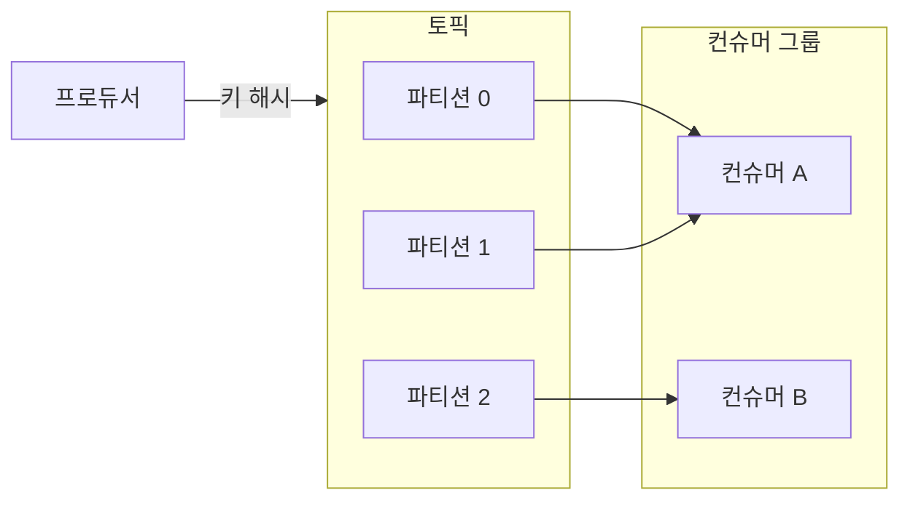

# Kafka 아는척하기

> 📝 **Notion**: https://app.notion.com/p/3d0d7d6851ff80d7a7dbd2b65118ec1b
> 🏷️ **프로젝트**: MSA Kafka · **작성일**: 2026-09-03

> **🧩 한 줄 요약** — 카프카는 **토픽**을 여러 **파티션**(추가만 되는 로그 파일)으로 쪼개 저장하고, **파티션이 곧 병렬·순서 보장의 단위**다. 프로듀서는 키로 파티션을 고르고, 컨슈머는 그룹으로 나눠 파티션을 나눠 읽는다. 빠른 이유는 **디스크를 로그처럼 순차 처리 + 페이지 캐시 + Zero Copy** 덕분이다.

---

## 1. 구성요소 4가지

- **카프카 클러스터** — 메시지를 저장하는 저장소. 여러 대의 **브로커**(각각의 서버)로 구성.
  - 브로커가 하는 일: 메시지 **분산 처리 · 복제(이중화) · 장애 처리**. 즉 단순 중계가 아니라 **영구 저장·복제·오프셋 관리를 하는 분산 DB**에 가깝다.
- **주키퍼(앙상블)** — 브로커 메타데이터·리더 선출을 관리. → 아래 토글(KRaft) 참고.
- **프로듀서** — 토픽에 메시지를 **넣는** 쪽.
- **컨슈머** — 토픽에서 메시지를 **읽는** 쪽.

🆕 주키퍼는 이제 걷어내는 추세 — KRaft

  - 예전엔 카프카가 클러스터 상태를 **주키퍼**라는 별도 시스템에 맡겼다(운영 부담·구성요소 2개).
  - Kafka 3.x부터 **KRaft** 모드로 브로커가 스스로 메타데이터를 관리하고, **4.0(2025)부터 주키퍼는 완전히 제거**됐다. 신규 구축은 KRaft가 기본.

> **🏢 브로커를 늘리면** — 디스크 용량↑ · 처리량 분산 · 고가용성. 브로커 제거도 가능하지만, 그 브로커가 맡던 **파티션을 살아있는 브로커로 이주(reassign)** 시켜야 한다.

---

## 2. 토픽과 파티션

- **토픽** — 메시지를 성격별로 구분하는 이름 (RDBMS 테이블 / 파일 폴더 느낌).
- **파티션** — 토픽을 이루는 **추가만 가능한(append-only) 물리 로그 파일**. 하나의 토픽 = 여러 파티션.
  - **오프셋** — 파티션 안에서 메시지의 위치 번호. 프로듀서가 넣으면 **맨 뒤에 추가**되고, 컨슈머는 오프셋 순서대로 읽는다.
  - 컨슈머가 읽어도 메시지는 **바로 지워지지 않는다** (아래 정정 참고).

### 2-1. 프로듀서는 어느 파티션에 넣나

| 방식 | 동작 | 순서 |
| --- | --- | --- |
| **라운드로빈** | 파티션에 골고루 분산 | 순서 보장 없음 |
| **파티션 키(해시)** | 같은 키 → 항상 같은 파티션 | 같은 키끼리 순서 보장 |

---

## 3. 컨슈머 그룹 · 순서 · 확장성

- **컨슈머 그룹** — 하나의 파티션에는 **그룹당 컨슈머 1개만** 연결된다. 그래서 한 그룹 안에서 파티션 메시지는 순서대로 처리된다.
- **순서 보장** — **단일 파티션 안에서만** 보장된다. 파티션이 다르면 처리 순서가 뒤섞일 수 있다. → 순서가 중요한 이벤트는 **파티션 키(예: 사용자ID)** 로 같은 파티션에 몰아넣는다.
- **확장성** — 파티션 수를 늘리면 동시에 읽는 컨슈머를 늘려 트래픽 스파이크에 대비할 수 있다.

> **⚠️ 파티션 수의 함정**
>
> **(1) 한 번 늘리면 못 줄인다** — 가장 신중히 정할 값. **(2) 늘리는 순간 키→파티션 해시 매핑이 바뀌어**, 그 시점부터 같은 키가 다른 파티션에 갈 수 있다(과거와의 순서 보장 깨짐). **(3) 컨슈머 수 > 파티션 수**면 초과 컨슈머는 **놀게 된다**(1파티션 1컨슈머 규칙 때문).

🔎 오프셋 커밋 · 리밸런싱

  - **오프셋 커밋** — 컨슈머가 "어디까지 읽었는지"를 카프카에 저장한다. 그래야 재시작·장애 후 이어서 읽는다.
  - **리밸런싱** — 그룹에 컨슈머가 들고 나면 파티션-컨슈머 배정을 다시 나눈다. 이 동안 잠깐 소비가 멈춘다.

---

## 4. 복제 (Replica)

- **리플리카** = **파티션의 복제본**. 파티션마다 복제본을 **여러 브로커에 흩어** 둔다.
- **리더 / 팔로워**
  - **리더** — 프로듀서·컨슈머는 **리더를 통해서만** 읽고 쓴다.
  - **팔로워** — 리더 데이터를 계속 복제(**ISR**, 리더를 잘 따라잡는 팔로워 집합).
- 리더 브로커가 죽으면 **ISR 팔로워 중 하나가 새 리더**가 된다 → 무중단.

> **❌ 정정 — 원본에서 어긋난 두 곳**
>
> **(1) "브로커가 리더/팔로워로 나뉜다" (X)** — 리더·팔로워는 **브로커가 아니라 파티션(레플리카) 단위**다. 한 브로커가 파티션 A에선 리더, 파티션 B에선 팔로워일 수 있다.
>
> **(2) "메시지는 삭제 안 됨" (부분적으로 X)** — 컨슈머가 읽어도 안 지워지는 건 맞지만, **retention(보존 기간·용량)** 이 지나면 삭제된다. "영원히 남는다"는 아니다.

---

## 5. 카프카가 빠른 이유

- **페이지 캐시** — 파티션 파일 I/O를 OS **페이지 캐시(메모리)** 에서 처리. 그 서버를 카프카 전용으로 쓰면 캐시 적중률이 높아 유리. (원본의 "OS 패키지캐시"는 **페이지 캐시**의 오기)
- **Zero Copy** — 디스크 → 네트워크로 보낼 때 유저 공간 복사를 생략(`sendfile`)해 전송이 빠르다.
- **Dumb broker, smart client** — 브로커는 저장·전달만 단순하게. 필터·재전송 등 복잡한 일은 프로듀서·컨슈머가 맡아 브로커 부하를 낮춘다.
- **배치 처리** — 메시지를 모아 한 번에 주고받는다.
- **쉬운 수평 확장** — 용량 부족 → 브로커·파티션 추가, 소비 지연 → 컨슈머 추가.

---

## 6. 정리

| 개념 | 한 줄 정의 |
| --- | --- |
| 클러스터 | 브로커들의 집합 = 전체 저장소 |
| 토픽 | 메시지를 성격별로 구분하는 카테고리 |
| 파티션 | 추가만 되는 로그 파일 — **병렬·순서 보장의 단위** |
| 브로커 | 파티션을 저장·복제·서빙하는 서버(분산 DB) |
| 오프셋 | 파티션 안 메시지 위치 번호 |
| 컨슈머 그룹 | 파티션을 나눠 읽는 컨슈머 묶음(1파티션 1컨슈머) |
| 리더/팔로워 | 파티션 레플리카의 읽쓰 담당 / 복제 대기(ISR) |

## 🔁 셀프 체크

1. 카프카에서 메시지 순서는 **어디까지** 보장되나? 왜 그런가?
2. 특정 사용자의 이벤트 순서를 반드시 지키려면 어떻게 설계하나?
3. "리더·팔로워는 브로커 단위로 나뉜다"는 왜 부정확한가?

답

  1. **단일 파티션 안에서만** 보장된다. 파티션은 append-only 로그라 오프셋 순서가 고정이지만, 서로 다른 파티션 간에는 순서가 없기 때문.
  2. 그 사용자ID를 **파티션 키**로 써서 항상 같은 파티션에 들어가게 한다 — 같은 키는 같은 파티션이라 순서가 유지된다.
  3. 리더·팔로워는 **파티션(레플리카) 단위**다. 한 브로커가 어떤 파티션에선 리더, 다른 파티션에선 팔로워가 될 수 있어 "브로커가 리더/팔로워"라는 말은 성립하지 않는다.

> **🔗 이어지는 것** — MSA에서 카프카는 서비스 간 **비동기 이벤트 버스**로 쓰인다. 이때 파티션 키 = **엔티티ID(주문·사용자)** 로 잡아 이벤트 순서를 지키고, 소비 실패는 **재시도 토픽 / DLQ(Dead Letter Queue)** 로 흘려보내는 설계가 이어진다.

---

📄 원본 노트 (정리 전 원문 보관)

  - 카프카 구성요소(4개)
    - 카프카 클러스터
      - 메시지를 저장하는 저장소
      - 하나의 카프카 클러스터는 여러 개의 블로커로 구성
        - 브로커 : 각각의 서버
          - 메시지 분산 처리
          - 이중화 처리
          - 장애처리
    - 주키퍼 클러스터(앙상블)
      - 카프카 클러스터를 관리하는 역할
    - 프로듀서
      - 메시지를 카프카에 넣는 역할(토픽에 넣는다)
    - 컨슈머
      - 메시지를 카프카에서 읽어내는 역할(토픽에서 메시지를 읽어낸다)
  - 토픽과 파티션
    - 토픽(RDBMS의 테이블 같이 데이터 성격에 따라 구분하는 이름)
      - 메시지를 구분하는 단위(파일 시스템 폴더 같은 느낌)
      - 하나의 토픽에는 여러 파티션으로 구성
    - 파티션(추가만 가능한 파일)
      - 메시지를 저장하는 물리적인 파일 
        - 오프셋
          - 메시지 저장 위치
        - 프로듀서가 메시지를 넣으면 **파티션의 뒤에 추가**
        - 컨슈머는 오프셋 기준으로 메시지를 순서대로 읽음
        - 메시지는 삭제 안됨
      - 프로듀서는 어떤 기준으로 파티션을 선택하지?
        - 라운드로빈
        - 파티션 키(해시값 사용해서 같은 키라면 같은 파티션으로 )
          - 키가 같다? 그럼 순서 보장이 된다 
      - 컨슈머는?
        - 컨슈머 그룹이 있고
          - 하나의 **파티션**에는 컨슈머 그룹의 **한 개 컨슈머**만 연결가능
          - 한 컨슈머 그룹 기준으로 파티션의 메시지는 순서대로 처리
      - 중요!
        - 순서보장 
          - 단일 파티션 내부에서만 메시지 순서 보장→ 데이터 처리 순서가 뒤섞일 수도
          - 메시지 전송 시 파티션 키(e.g. 사용자ID)로 지정하여 이벤트가 항상 동일한 파티션에만 들어가도록 설계
        - 확장성
          - 파티션 개수를 늘리면 동시에 작업 할 수 있는 컨슈머 수를 늘려 트래픽 스파이크 대비 가능 
          - 하지만 한 번 늘리면 다시 못 줄인다 (가장 신중하게 결정해야한다)
    - (토픽을 기준으로 메시지를 주고 받는다 )
  - 카프카 성능
    - 파티션 파일은 OS 패키지캐시 사용
      - 파티션 파일 I/O 작업을 메모리에서 처리
      - 서버에서 패키지캐시를 카프카만 이용하면? 성능에 유리
    - Zero Copy
      - 디스크 읽어서 네트워크로 보내는 속도가 빨라짐
    - 컨슈머 추적을 위해 브로커가 하는 일이 단순 
      - 메시지 필터, 재전송 등은 프로쥬서랑 컨슈머가 거의 다함 
    - 배치 처리 가능
    - 처리량 확장 쉽다
      - 용량이 부족해? 브로커나 파티션을 추가해
      - 컨슈머가 느려? 컨슈머 추가해
  - 카프카 리플리카(복제)
    - 리플리카 : **파티션**의 복제본
      - 파티션의 복제본은 각각의 브로커에 생김
      - 브로커는 리더랑 팔로워로 분리
        - 리더 : 프로듀서랑 컨슈머는 리더를 통해서만 메시지 처리
        - 팔로워 : 팔로워는 리더데이터 복제
      - 장애가 생겨도 다른 팔로워가 리더가 되면 된다 
  - 정리
    - 클러스터 : 저장소
    - 토픽 : 클러스터 속 카테고리
    - 파티션 : 컨테이너 벨트 역할
    - 브로커 : 파티션으로 부터 받은 메시지를 보관 처리(작은 저장소느낌)
  [추가 궁금한 거]
  - 브로커는 단순한 매핑 역할?
    - 데이터를 **안전하게 저장하고 복제하는 분산 데이터베이스 역할**
      - 영구 저장, 복제, 오프셋 관리
  - 브로커가 많으면 좋은 점
    - 디스크 용량이 많아짐
    - 처리량 분산
    - 고가용성
  - 브로커는 한 번 생성하고 없앨 수 있음?
    - 쌉가능 대신 없앨 브로커가 담당하던 파티션을 다른 살아있을 브로커로 이주해야 함

