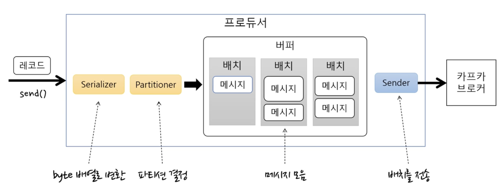
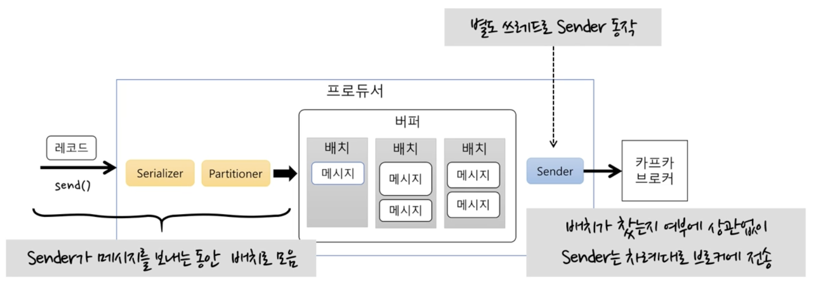

# Kafka 아는척하기2 (프로듀서)

> 📝 **Notion**: https://app.notion.com/p/3d0d7d6851ff80a09329e59cea4d8f83
> 🏷️ **프로젝트**: MSA Kafka · **작성일**: 2026-09-07

---
## 토픽에 메시지 전송
- Properties(설정 정보)로 KafkaProducer 객체 생성 → send() 메서드 호출 → ProducerRecord(카프카 브로커에 전송할 메시지) 전송
- ProducerRecord
  - 토픽 이름 + key + value 로 생성
  - 토픽 이름 + value 로 생성

---
## 프로듀서의 기본 흐름

- send() : 레코드 전송
- Serializer : 레코드를 byte array로 변환해서 메시지 생성
- Partitioner : 메시지를 그 토픽의 몇 번 partition으로 보낼지 결정
- buffer와 batch : 변환된 byte array 메시지 → buffer에 batch로 묶어서 저장(카프카의 성능)
- Sender : 카프카 브로커로 전송

  

  - 별도 thread로 동작
  - batch가 찼는지 여부에 상관 없이 Sender는 차례대로 브로커에 전송
  - Sender가 브로커에 메시지를 보내는 동안, send()로 들어온 레코드는 batch로 모인다
  - send()와 Sender는 각각 독립적으로 동작한다
  - Sender는 메시지를 보낼 수 있으면 무조건 보낸다

---
## batch와 Sender 관련된 설정이 성능에 영향을 미친다
- `batch.size` : batch **하나의 최대 크기(상한선)** — 기본 16KB
  - 주의 : "이만큼 차면 보낸다"가 아니라 "batch가 이보다 커지지 않게 막는다"는 뜻
  - 실제 전송 시점은 Sender에 여유가 생겼을 때 → Sender가 앞 요청을 보내느라 바쁜 동안 뒤에서 batch가 쌓이는 구조
  - 너무 작게 설정하면 너무 많이 보내니까 처리량이 떨어진다
- `linger.ms` : 전송 전 대기시간 설정 (기본 0 = 기다리지 않고 바로 전송)
  - 기다리는 동안 batch에 다른 메시지가 쌓이게 된다 → 한 번에 더 많은 메시지를 보낼 수 있는 여지가 생김
  - 약간만 주면 한 번에 보내는 메시지 개수가 많아지니까 전반적인 처리량이 늘어난다

---
## send() 메서드를 통해 메시지를 보내면 전송이 성공인지 실패인지 알 수 없다
- 실패처리가 필요 없으면 상관없지만
- 성공인지 실패인지 알려면?
  - send()가 return하는 Future 사용 : Future의 get() 메서드로 성공 결과를 알 수 있다
    - 문제 : Future의 get()을 사용하면 blocking이 된다
      - 만약 루프를 돈다면? 하나의 메시지를 보내고 blocking되는 일이 반복된다
      - batch에 메시지가 1개만 들어가고 처리량이 떨어짐, 대신 건별로 확실함
  - send() 메서드에 Callback 객체 사용
    - Callback 객체 : 전송이 완료되면 그 결과를 onCompletion() 메서드로 받는데, 이때 Exception 객체를 받으면 실패
      - blocking 방식이 아니라 처리량 저하 없음

---
## 전송 보장과 acks
- `acks = 0`
  - 서버로부터 응답을 기다리지 않음, 즉 전송 보장이 안됨
  - 처리량은 늘어도 메시지가 유실되더라도 실패여부를 알 수 없다
- `acks = 1`
  - partition의 leader에 저장이 되면 성공
  - leader에 장애가 발생하면 메시지 유실 가능성 있다
- `acks = all`
  - 모든 replica가 아니라 **ISR(In-Sync Replicas, 동기화된 replica)** 전부에 저장되었을 때 성공
    - leader를 못 따라온 replica는 ISR에서 빠지기 때문에, 최악의 경우 leader 1개에만 저장되고 성공이 될 수도 있다 → 그래서 min.insync.replicas가 필요
- `acks` + `min.insync.replicas`
  - `acks = all`일 때 저장에 성공했다고 응답할 수 있는 동기화된 replica 최소 개수
    - acks는 producer 설정, min.insync.replicas는 broker/topic 설정
  - e.g. replica 개수 = 3, `min.insync.replicas = 2`
    - leader에 저장하고 follower 중 하나에 저장하면 성공 응답
  - 중요 : `min.insync.replicas`는 replica 개수보다 작게 설정한다
    - 같게 두면 브로커 1대만 죽어도 ISR이 모자라서 쓰기가 전부 실패한다 (NotEnoughReplicasException)

---
## 에러 유형
- 전송 과정에서 실패
  - timeout
  - leader 문제 → 새 leader 선정
  - 브로커 설정 메시지 한도 초과
- 전송 전 실패
  - 직렬화(serialize) 실패(메시지를 0과 1로 변환하는 과정), 프로듀서 자체 요청 크기 제한 초과
  - 프로듀서 buffer가 차서 기다린 시간이 최대 시간 초과

---
## 재시도
- 재시도 가능하면 재시도 하기
- 프로듀서는 가능하면 재시도를 한다
  - send() 메서드에서 예외 발생 시, Exception 타입에 따라 send() 재호출
  - Callback 메서드 : 예외를 받으면 타입에 따라 send() 재호출
  - 대신 무한 재시도는 안된다 (일정 시간이나 횟수 설정하기)
    - 요즘 카프카는 `retries`가 사실상 무한이고, 대신 `delivery.timeout.ms`(기본 2분)가 전체 재시도 시간을 잘라준다

---
## 기록
- 별도 파일이나 DB를 이용해서 메시지 기록
- 추후에 수동/보정 작업 진행
  - send() 메서드에서 예외 발생 시, Callback에서 예외 받는 경우, Future의 get() 메서드에서 예외 발생 시 기록하기

---
## 재시도와 메시지 중복 전송 가능성
- 브로커가 저장은 했는데 응답이 유실되면, 프로듀서는 실패로 알고 재시도 → 같은 메시지가 2번 저장됨
- 해결 : `enable.idempotence = true` (Kafka 3.0부터 기본값)
  - 프로듀서에 고유 ID를 부여하고 메시지마다 순번을 붙여서, 브로커가 이미 저장한 번호는 버린다

---
## 재시도 때문에 메시지 순서가 바뀌는 문제
- 원인 : `max.in.flight.requests.per.connection`
  - blocking 없이 한 connection에서 전송할 수 있는 최대 전송 중인 요청 개수 (기본 5)
  - 이 값이 1보다 크면 재시도 시점에 따라 메시지 순서가 바뀔 수도 있다
- 해결
  - 예전 방식 : 값을 1로 설정 → 순서는 지켜지지만 처리량이 크게 떨어짐
  - 요즘 방식 : `enable.idempotence = true`면 값이 5까지여도 순서가 보장된다
