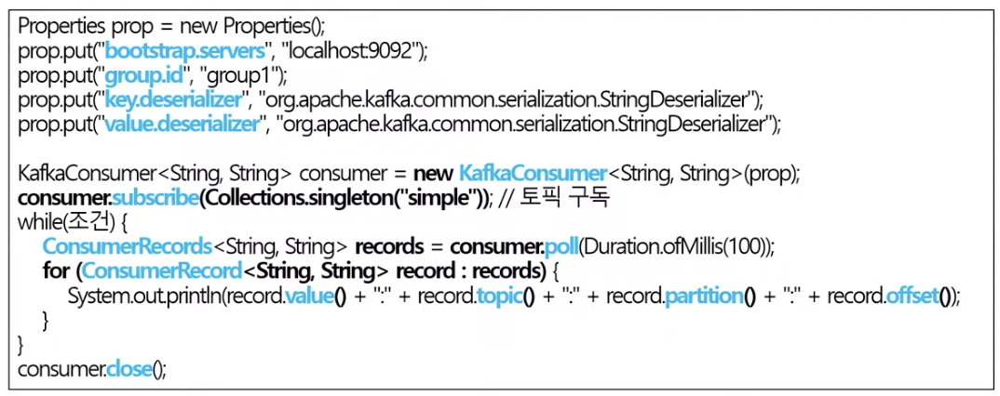
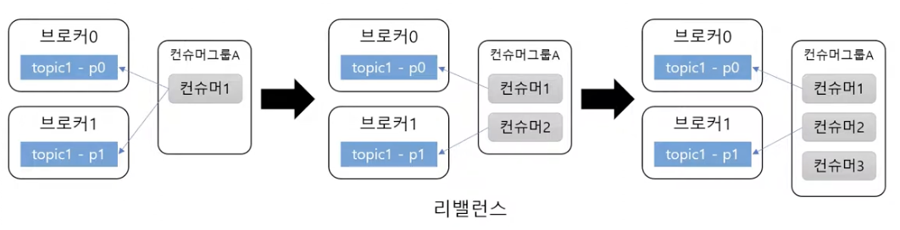
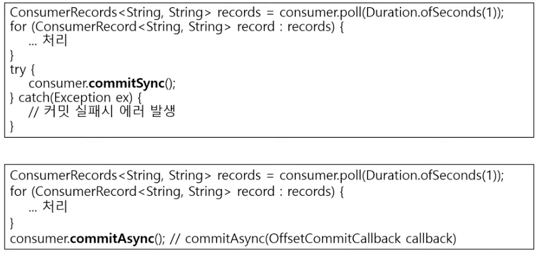

# Kafka 아는척하기3 (컨슈머)

> 📝 **Notion**: https://app.notion.com/p/3d0d7d6851ff803896a5ee3657ecad09
> 🏷️ **프로젝트**: MSA Kafka · **작성일**: 2026-09-08

---
## 특정 토픽 파티션에서 레코드를 조회하는 역할

- 그룹 ID 지정(중요)
- Properties 설정(역직렬화 Deserializer 지정) → 카프카 컨슈머 객체 생성
  - 구독 메소드 호출 → 내가 구독할 토픽 목록 전달
  - 특정 조건에 맞도록 루프를 돌고 poll 호출
    - (일정시간 대기하다가 브로커로부터 컨슈머 레코드 읽기 그리고 또 루프를 돌면서 처리하는 것)
  - 다하면 닫기

---
## 토픽 파티션은 그룹 단위로 할당

- 그룹 ID 지정이 각 컨슈머 그룹을 말하는 거다
- 파티션 개수와 컨슈머 개수는 밀접한 관련있다
  - 파티션 개수 < 그룹 안의 컨슈머 개수 → 컨슈머는 논다
  - 즉, 파티션 개수 ≥ 그룹 안의 컨슈머 개수 여야한다
  - 컨슈머 그룹끼리는 서로 독립적이라, 그룹이 몇 개든 각 그룹이 전체 파티션을 다 나눠 받는다
    - 즉, 컨슈머가 노는 건 한 그룹 안에서만 생기는 문제
  - 만약 컨슈머를 늘려야한다면? 파티션 개수도 같이 늘리기

---
## 커밋과 오프셋
- Poll 메소드 : 커밋한 오프셋 이후 레코드를 읽는다 → 마지막으로 읽은 레코드 오프셋 커밋함
  - 다음 풀 메소드를 실행하면 마지막으로 커밋된 오프셋 이후로 레코드를 읽는다(반복)
  - 단, 커밋은 자동 커밋(`enable.auto.commit=true`)일 때만 일어난다
    - 그리고 poll()마다가 아니라 `auto.commit.interval.ms`(기본 5초)가 지났을 때만 커밋한다
    - → 리밸런스가 나면 최대 5초치를 중복으로 다시 읽게 되는 이유
  - 커밋되는 값은 마지막으로 읽은 오프셋 + 1 (다음에 읽을 위치)

### 근데 커밋된 오프셋이 없다면?
- `auto.offset.reset` 사용
  - `earliest` : 가장 처음 오프셋 사용
  - `latest` : 가장 마지막 오프셋 사용
  - `none` : 예외 발생

---
## 컨슈머 설정
- `fetch.min.bytes` : 조회할 때 브로커가 전송할 최소 데이터 크기
  - 값이 클수록 대기시간이 늘지만 처리량은 커짐
- `fetch.max.wait.ms` : 데이터가 최소 크기가 될 때까지 기다릴 시간
  - 데이터가 안쌓인다고 마냥 기다릴 수 없으니까 이 시간 이후로는 데이터 전송
  - 브로커가 리턴할 때까지 대기하는 시간, poll 메서드의 대기 시간과 다름
- `max.partition.fetch.bytes` : 파티션 당 서버가 리턴할 수 있는 최대 크기
  - 트리거가 아니라 상한선(뚜껑) — 파티션당 이보다 많이는 안 보낸다는 뜻
  - 전송을 시작시키는 건 `fetch.min.bytes`(최소 크기 도달)와 `fetch.max.wait.ms`(시간 초과) 둘뿐

---
## 자/수동 커밋
- `enable.auto.commit`
  - T : 일정주기로 컨슈머가 읽은 오프셋 커밋
  - F : 수동 커밋
- `auto.commit.interval.ms` : 자동 커밋 주기
- `poll()`, `close()` 메서드 호출 시 자동 커밋 실행

### 수동 커밋 : 동기 / 비동기 커밋

- 동기(`commitSync()`)
  - 커밋 성공하면 성공
  - 실패하면 익셉션(에러) → 예외 처리 필요
- 비동기(`commitAsync()`)
  - 코드 자체에서 바로 실패 여부 알 수 없다
  - 알려면? 콜백(Callback)이 필요 (프로듀서 send()의 Callback과 같은 구조)
  - `commitAsync()`는 재시도를 하지 않는다 (재시도하면 옛 오프셋이 나중 커밋을 덮어써서 순서가 꼬임)
    - 그래서 실무 패턴은 루프 안에선 `commitAsync()`, 종료 직전 `finally`에서 `commitSync()`

---
## 재처리와 순서
- 주의 : 컨슈머가 동일한 메시지를 읽어올 수 있기에
  - (e.g. 일시적 커밋 실패, 리밸런스가 발생한 경우)
- 멱등성을 고려해야 함
- 데이터 타입에 따라 타임스탬프나 일련 번호도 사용하기

---
## 세션 타임아웃, 하트비트, 최대 poll 간격
- 컨슈머는 하트비트를 전송해서 연결 유지
  - 브로커가 일정시간 컨슈머로부터 하트비트를 못받으면 컨슈머를 그룹에서 빼고 리밸런스 한다
  - 하트비트는 별도 백그라운드 스레드가 보낸다
    - 그래서 연결 확인(`session.timeout.ms`)과 처리 지연 확인(`max.poll.interval.ms`)이 따로 존재한다
    - 메시지 처리가 오래 걸려도 하트비트는 계속 나가니까, 처리 지연은 `max.poll.interval.ms`가 따로 잡아준다
  - 설정
    - `session.timeout.ms` : 세션 타임 아웃 시간(타임아웃 나면 리밸런싱한다)
    - `heartbeat.interval.ms` : 하트비트 전송 주기
      - `session.timeout.ms`의 1/3을 추천
- `max.poll.interval.ms` : poll() 메서드의 최대 호출 간격
  - 이 시간이 지나도록 poll()을 안 하면 컨슈머를 빼고 리밸런싱 함

---
## 종료 처리
- 컨슈머 다 사용하면 종료 처리해야하는데 루프를 벗어나게 하려면?
  - `wakeup()` 메서드 사용
    - 다른 스레드에서 `wakeup()` 메서드 호출하면
      `poll()`이 `WakeupException` 발생 시키고 → `close()` 메소드로 종료 처리

---
## 컨슈머는 스레드에 안전하지 않다
- 그래서 여러 스레드에서 동시에 사용하지 말기
  - `wakeup()`만 예외
