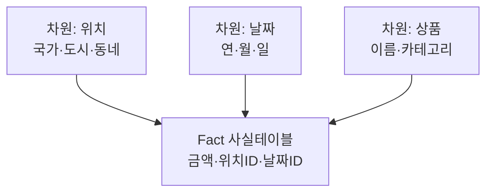

# OLTP와 OLAP

> 📝 **Notion**: https://app.notion.com/p/3cfd7d6851ff8063bad0fb97ff1fc752
> 🏷️ **프로젝트**: MoniMonitor · **작성일**: 2026-09-03

> **🧩 한 줄 요약** — OLTP와 OLAP은 "빠르게 처리 vs 깊게 분석"이라는 **목적의 차이**로 시작하지만, 실제로는 **행 지향 vs 열 지향 저장 · 스타 스키마 · 비트맵/압축/SIMD**까지 물리 구조가 통째로 갈라진다. 그래서 한 서버에 두지 않고 **분석용 저장소로 옮겨서** 쓴다.

---
## 1. 두 방향성
- **OLTP** (Online **Transaction** Processing) — 서비스가 돌아가게 하는 쪽
  - 주문 1건 저장, 사용자 1명 조회처럼 **적은 행을 빠르고 정확하게**
  - 그래서 **정규화 · ACID · 인덱스**가 중요
- **OLAP** (Online **Analytical** Processing) — 데이터를 들여다보는 쪽
  - "지난 3년 매출을 지역별 · 월별로"처럼 **대량의 행을 훑어 집계**
  - 그래서 **비정규화 · 대량 스캔 · 집계 성능**이 중요

|  | **OLTP** | **OLAP** |
| --- | --- | --- |
| 대상 행 수 | 한 건에서 수십 건 | 수백만에서 수억 건 |
| 쿼리 | 단순 CRUD, PK 조회 | `GROUP BY` · 대규모 `JOIN` · 윈도우 함수 |
| 응답 시간 | 밀리초 | 초에서 분 |
| 동시성 | 매우 높음 (수많은 사용자) | 낮음 (소수 분석가 · 배치) |
| 데이터 | 최신 상태값 | 누적된 이력 |
| 대표 제품 | MySQL, PostgreSQL | BigQuery, Redshift, ClickHouse |

---
## 2. 진짜 차이 — 행 지향 vs 열 지향
**"왜 굳이 나누냐"의 답이 여기 있다.**
```
같은 테이블 (id, 이름, 나이, 도시)

행 지향 (OLTP)   [1,홍길동,30,서울] [2,김철수,25,부산] [3,이영희,41,대구] ...
                 → 한 사람의 정보가 한 덩어리로 붙어 있음

열 지향 (OLAP)   [1,2,3,...] [홍길동,김철수,이영희,...] [30,25,41,...] [서울,부산,대구,...]
                 → 같은 컬럼끼리 붙어 있음
```
- `SELECT * FROM 회원 WHERE id = 1` → **행 지향 압승**. 디스크 한 군데만 읽으면 끝
- `SELECT AVG(나이) FROM 회원` → **열 지향 압승**. 나이 컬럼만 쭉 읽으면 되고, 행 지향은 **필요 없는 이름 · 도시까지 전부** 읽어야 한다
- **압축률**도 다르다. 열 지향은 같은 컬럼끼리 모여 값이 비슷해 훨씬 잘 압축된다 → 읽을 바이트 자체가 줄어든다

한 줄로: **OLTP는 "한 줄 전체", OLAP은 "한 칸 전부"를 읽는다.**

---
## 3. OLAP의 저장 설계 — 스타 스키마
열 지향만으로 끝이 아니다. OLAP은 **조인 자체를 줄이려고 테이블 구조**를 다르게 짠다. 수십 개로 정규화하면 집계 때 조인이 폭발하므로, 크게 **두 종류**로 뭉쳐 별 모양을 만든다.



- **Fact(사실) 테이블** — 별의 중심. **측정값**(금액·수량)과 차원으로 가는 **FK**만 담는다. 행이 수억 개로 가장 크다.
- **Dimension(차원) 테이블** — 별의 모서리. 그 사실을 설명하는 텍스트 속성(국가·도시·상품명)을 **비정규화해 한 테이블에** 몰아 둔다.
- **장점** — 조인이 `Fact ↔ 차원` **1단계**로 얕다. 다단계 조인 지옥을 피한다.
- **단점** — 차원 속성이 중복 저장돼 디스크를 낭비한다(분석에선 감수).

<details>
<summary>🔎 스노플레이크 스키마 — 차원을 다시 정규화한 변형</summary>

  - 차원 테이블을 또 쪼개 정규화하면 별의 모서리가 눈송이처럼 뻗는다 → **스노플레이크 스키마**.
  - 중복은 줄지만 조인이 다시 늘어난다. OLAP에선 보통 **스타 스키마(비정규화)** 를 선호한다.

</details>

---
## 4. 인덱스·스캔 전략 — 핀셋 vs 불도저
같은 "빠르게"라도 방식이 정반대다. OLTP는 **특정 몇 행을 콕 집고**, OLAP은 **컬럼 전체를 거칠게 쓸어 담는다.**
- **OLTP** — **B-Tree** · **InnoDB 클러스터드 인덱스**(PK 기준 정렬). 원하는 행으로 바로 점프.
- **OLAP** — 세 가지 무기를 쓴다.
  - **비트맵 인덱스** — 값마다 `0/1` 배열. 성별·상태처럼 **카디널리티가 낮을 때** 유리 (쓰기가 잦으면 갱신 비용이 커 OLTP엔 부적합).
  - **컬럼 압축** — 딕셔너리(`1=결제완료, 2=취소`로 등록 후 `1,1,1,2,1…` 저장), RLE(같은 값 10만 번 → "1이 10만 번 반복"으로 한 줄).
  - **벡터화 스캔(SIMD)** — 행을 하나씩 조건 검사(느림) 대신, 컬럼 블록을 CPU 캐시에 올려 **한 명령으로 여러 값 동시 처리**.

> **🚜 핀셋 vs 불도저** — OLTP는 B-Tree라는 정교한 핀셋으로 한 행을 집는다. OLAP은 그 핀셋을 버리고, 극도로 **압축**한 데이터를 **비트맵**과 **블록 단위 스캔(SIMD)** 으로 통째로 갈아 마시는 불도저다.

---
## 5. 왜 한 서버에 두면 안 되는가
"컴퓨터 터진다"는 감각이 맞다. 정확히는 두 가지가 일어난다.
- **자원 경합** — 분석 쿼리 하나가 CPU·디스크 IO를 오래 붙잡으면, 밀리초 안에 끝나야 할 주문 처리가 뒤에서 밀린다.
- **버퍼 풀(캐시) 오염** — 대량 스캔이 자주 쓰이던 페이지를 캐시에서 **밀어낸다**. 분석 쿼리가 끝난 뒤에도 한동안 OLTP가 느려진다 (InnoDB의 midpoint insertion 같은 완화 장치는 있지만 완벽하진 않다).

이렇게 성격이 다른 작업을 물리적으로 떼어놓는 것을 **워크로드 격리(Workload Isolation)** 라고 한다.

---
## 6. 어떻게 분리하나

| 방법 | 어디까지 되나 |
| --- | --- |
| **리드 레플리카** | 가벼운 리포팅까지. 스키마가 원본과 같아 진짜 OLAP은 무리 |
| **데이터 웨어하우스** | 본격 분석. **ETL/ELT**나 **CDC**로 옮기고 열 지향으로 재저장 |
| **HTAP** | 하나에서 둘 다 (TiDB, SingleStore 등). 아직은 절충안 |

> **❌ 정정 — "Slave는 OLAP, CQRS의 읽기는 OLAP"**
>
> **(1) 리드 레플리카는 OLAP이 아니다.** 스키마가 원본과 **똑같은 행 지향**이라 대량 집계에 불리하고, 무거운 쿼리를 돌리면 **복제 지연이 커져** 그 레플리카를 쓰는 서비스가 옛날 데이터를 보게 된다. "OLTP 부하 분산"까지는 맞지만 "OLAP 담당"은 과한 말이다.
>
> **(2) CQRS의 읽기 모델도 대개 OLAP이 아니다.** 화면에 바로 뿌릴 데이터를 미리 조립해 둔 것이라 **여전히 단건 · 목록 조회(OLTP성)** 다. 원본이 "무조건은 아님"이라 단 단서가 정확했다 — CQRS는 **읽기/쓰기 분리**이지 **OLTP/OLAP 분리**가 아니다.

> **⚠️ 함정 — 분석 쿼리를 서비스 레플리카에 돌리는 것**
>
> 가장 흔한 사고다. 레플리카를 사용자 읽기 트래픽에도 쓰고 있다면, 누군가 돌린 분석 쿼리 하나가 **복제 지연 → 사용자에게 낡은 데이터 노출**로 이어진다.
>
> → 분석 전용 레플리카를 따로 두거나, 아예 DW로 빼야 한다.

---
## 7. 정리

| 개념 | 한 줄 정의 |
| --- | --- |
| OLTP | 적은 행을 빠르고 정확하게 처리하는 **운영용** 워크로드 |
| OLAP | 대량의 행을 훑어 집계하는 **분석용** 워크로드 |
| 행 지향 / 열 지향 | 한 레코드를 붙여 저장(단건 유리) / 같은 컬럼을 붙여 저장(집계·압축 유리) |
| 스타 스키마 | Fact(측정값)+Dimension(비정규화 속성)으로 조인을 1단계로 줄인 구조 |
| 비트맵 인덱스 | 값마다 0/1 배열 — 저카디널리티 컬럼 집계에 유리 |
| 벡터화 스캔(SIMD) | 컬럼 블록을 한 명령으로 동시 처리하는 OLAP 스캔 방식 |
| 워크로드 격리 | 성격이 다른 작업을 물리적으로 분리하는 것 |
| ETL / ELT · DW | 운영 DB 데이터를 분석 저장소로 옮기는 파이프라인 · 분석용으로 재구성해 쌓은 저장소 |
| HTAP | 하나의 시스템에서 OLTP와 OLAP을 모두 노리는 접근 |

## 🔁 셀프 체크
1. 같은 데이터인데 OLAP 저장소를 **열 지향**으로 만드는 이유는?
2. 스타 스키마에서 차원 테이블을 굳이 **비정규화(중복 저장)** 하는 이유는?
3. "Slave · CQRS의 읽기 DB는 OLAP이다" — 왜 이 말이 어긋나는가?

<details>
<summary>답</summary>

  1. 분석 쿼리는 **몇 개 컬럼만 대량으로** 훑기 때문이다. 열 지향이면 필요한 컬럼만 읽어 IO가 줄고, 같은 타입 값이 모여 있어 **압축률도 훨씬 높다**. 반대로 한 행 전체를 꺼내는 OLTP에는 불리하다.
  2. 정규화하면 집계 때 **다단계 조인이 폭발**한다. 차원 속성을 한 테이블에 몰아 두면 `Fact ↔ 차원` 1단계 조인으로 끝나 스캔이 빨라진다 — 디스크 중복은 분석 성능을 위해 감수한다.
  3. 리드 레플리카는 **원본과 같은 행 지향**이라 대량 집계에 불리하고, CQRS 읽기 모델은 **단건·목록 조회(OLTP성)** 다. 둘 다 "읽기 부하 분산"이지 "운영/분석 분리"가 아니다.

</details>

> **🔗 이어지는 것** — §6의 분리 방식은 [CQRS와 Query Facade + S3](https://app.notion.com/p/3cfd7d6851ff80e1b814cd08d70257f2)의 동기화 파이프라인과 그대로 이어진다. MoniMonitor 같은 모니터링 데이터(메트릭 · 로그 · 트레이스)는 성격이 거의 완전히 OLAP이라, 실제로 ClickHouse 같은 **열 지향 DB**가 이 분야의 표준으로 쓰인다.

---
<details color="gray_bg">
<summary>📄 원본 노트 (정리 전 원문 보관)</summary>

  - 두 개념은 각각 데이터를 가지고 빠르게 처리할 거다, 분석할거다 라는 방향성을 말하는 거
  - OLTP 
    - 빠르고 정확하게 처리할 거임
    - 즉, 운영에 문제가 없도록 지원하는 것이 목적
      - 정규화, ACID 보장 등이 중요
  - OLAP
    - 무겁더라도 깊게 분석할 거임
    - 거대한 데이터를 바탕으로 '통계와 인사이트를 뽑아 내는 것이 목적
      - GROUP BY나 JOIN이 들어간 SELECT 등등
  - 어떻게 쓰면 될까?
    - 하나의 서버에서 사용하면 컴퓨터 터진다
    - 그래서, 아키텍처 레벨, 인프라 레벨에서 이 둘을 찢어놓는다
      - 레플리케이션 활용
        - Master는 OLTP
        - Slave는 OLAP
      - CQRS 활용
        - 쓰기는 OLTP
        - 읽기는 OLAP(무조건은 아님)
  - 이 둘의 물리적 저장방식 차이
    - OLTP
      - 행을 한 덩어리로 묶어서 디스크에 작성
        - 장 : 새 데이터는 `INSERT` 한방으로 끝남
        - 단 : 집계함수를 사용하면 열이아닌 행을 가져오니까 디스크 낭비가 심함<br>(불필요한 데이터까지 가져오게 된다) 
      - 테이블을 쪼개서 정규화를 한다(중복이 일어나면 데이터 불일치가 발생할 수 있으니)
    - OLAP
      - 열을 기준으로 모아서 저장한다
        - 장 : 집계함수 사용 시 열 하나만 가져오면 바로 구할 수 있다<br>데이터 타입이 모여 있기 때문에 데이터 압축률이 쩐다 
      - Fact 테이블(여러 개의 테이블을 JOIN하면 성승이 박살나니까)을 두고 차원 테이블을 비정규화 배치를 한다 
        - 스타 스키마 : 데이터 중복을 막기위해 수십 개로 정규화를 하니 JOIN이 너무 많아지니까 테이블을 크게 2개로 나워 별모양으로 뭉치는 방법  
          - 사실테이블(별의 중심)<br>e.g. **:** `[금액: 5000, 위치ID: 99, 날짜ID: 20260512]`
            - 측정한 값을 기록
          - 차원테이블(별의 모서리)<br>e.g. **:** `[위치ID: 99, 국가명: 대한민국, 도시명: 서울시, 동네명: 강남구]`
            - 그 사건이 뭘했는지 텍스트 데이터를 가지고 있음
            - 위치 테이블속 데이터 하나로 Fact테이블로가서 바로 찾을 수 있게 
          - 장: 무거운 JOIN 없음 
          - 단 : 데이터의 중복저장 → 디스크 낭비
  - 인덱스 전략의 차이
    - OLTP
      - **B-Tree 인덱스**나 **InnoDB의 클러스터링 인덱스(PK 기준 정렬)**
    - OLAP
      - 비트맵(Bitmap) 인덱스
        - 각 값마다 비트배열([1, 0, 1, 0])을 만든다(카디널리티가 적으면 좋다)
      - 컬럼 기반 압축
        - 딕셔너리 압축 : 사전에 `1=결제완료`, `2=취소`라고 등록하고 디스크엔  `1, 1, 1, 2, 1...` 같이 저장
        - RLE : 같은 값이 10만번 나오면 `[1이 100,000번 반복됨]`  처럼 한 줄로 압축
      - 블록단위 스캔
        - 보통 DB는 데이터를 Row로 올려서 조건 검사를 한다(이럼 느림)
        - 대신 OLAP 엔진을 이용한 DB는 데이터 수만 건을 CPU 캐시 메모리에 올리고 SIMD(한 번의 명령으로 여러 데이터를 동시 처리) 기술을 사용해 무식하고 거칠게 한 번에 쓸어버린다 
      - 요약 
        - OLAP는 정교한 핀셋(B-Tree, 정규화)을 버리고, 데이터를 극도로 **압축**한 뒤 0과 1로 이루어진 **비트맵**을 활용해, CPU가 가장 좋아하는 방식으로 **통째로(블록 단위) 갈아 마시는 불도저 같은 아키텍처**

</details>
